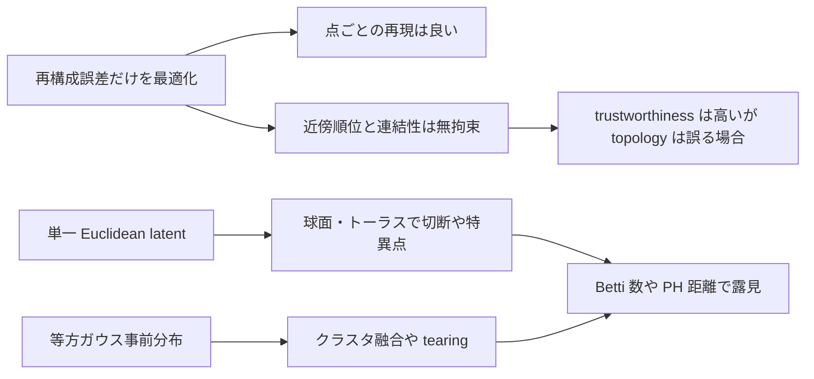

# 第1群の研究基盤監査と確定案

## エグゼクティブサマリ

通常の AE/VAE が「再構成は良いのに、近傍構造・連結性・大域トポロジーを壊す」主因は、第一に損失関数が点ごとの再構成誤差を主に最適化し、**近傍順位・測地線・連結成分・穴**を明示的には拘束しないこと、第二に VAE では **等方ガウス事前分布**が複雑な多様体構造へミスマッチし、クラスタ融合や tearing を起こしうること、第三に **単一のユークリッド潜在空間**では球面やトーラスのような非自明トポロジーを持つ多様体を忠実に表現できず、特異点や切断が避けられないことです。これらは Topological Autoencoders、Neighborhood Reconstructing Autoencoders、CkNN ベースの local distance preserving AE、Chart Auto-Encoders、Atlas/mixture 系モデル、Diffusion VAE、Topological Obstructions 系の理論で、それぞれ別の角度から確認されています。citeturn32view1turn18view1turn18view2turn29view0turn30view0turn37view0turn38view0turn24view0

このため、第1群で確立すべき研究基盤は、**MSE を主指標にしない**ことが前提です。特に、局所を測る指標として trustworthiness / continuity / kNN overlap、合成データで真のパラメータや測地線が分かる場合の rank correlation・geodesic correlation、大域トポロジーを測る Betti 数・persistent homology 距離・RTD を、**分離して**運用する必要があります。Topological Autoencoders は、古典的な rank 系指標が高くても SPHERES の入れ子構造を壊す例を示しており、CkNN 系の研究は Swiss roll 上で「近傍が良くても bridging が起きる」ことを明示しています。citeturn44view0turn31view1turn6view0turn18view3turn18view4

アップロード済みの A1 / D1 / D2 / D3 ノートは、**問題設定の方向性は概ね正しい**です。特に「MSE だけでは不十分」「局所指標と大域指標を分けるべき」「合成多様体が必要」という骨格は妥当です。一方で、参考文献には StackExchange、Emergent Mind、ResearchGate、将来時点の未成熟 preprint など、**第1群の基盤文書としては一次性が弱いもの**がかなり混在しており、ここは原論文・公式実装・公式ドキュメント中心に差し替えるべきです。とくに D3 はベンチマーク候補を広げすぎており、第1群では Klein bottle や Lie 群まで一気に入れず、まずは Swiss roll、two circles、nested spheres、torus などの**少数精鋭**に絞る方が正確で再現性が高いです。fileciteturn0file0 fileciteturn0file1 fileciteturn0file2 fileciteturn0file3 citeturn37view0turn38view0turn39academia0turn29view0

## ファイル監査と失敗様式の確定

A1 は、「通常 AE/VAE が再構成中心の目的で局所・大域構造を壊す」という主張自体は概ね妥当で、NRAE、TopoAE、Chart AE、mixture/atlas 系へ接続している点も正しいです。ただし、距離保存不能性や topological obstruction の根拠として、一次論文でなく周辺資料や二次資料に依存している箇所があり、**根拠の階層**を整理し直すべきです。基盤文書では、VAE の目的関数は Kingma & Welling、トポロジー障害は Diffusion VAE・Atlas Generative Models・Topological Obstructions and How to Avoid Them、局所幾何の失敗は NRAE と CkNN 系、グローバル構造の失敗は TopoAE に直接結び直すのが安全です。fileciteturn0file0 citeturn24view0turn30view0turn29view0turn37view0turn18view1turn18view2turn44view0

D1 は、Persistent Homology ベースの指標、Geometry Score、RTD を候補に入れている点は適切です。ただし、「Manifold-Matching Autoencoders」のような 2026 年の新規 preprint は、面白いがまだ第1群の**既定ベースライン**に置くには早いです。RTD は pointwise correspondence を持つ二表現比較には非常に有効ですが、一般の生成評価や latent 評価のすべてを置き換える万能指標ではありません。Geometry Score も良い補助指標ですが、ランドマーク抽出と witness complex の乱択に依存するので、**主指標ではなく補助指標**として使う方が安定します。fileciteturn0file1 citeturn18view3turn18view4turn5view4turn5view5turn39academia0

D2 は、trustworthiness / continuity / kNN overlap / geodesic correlation / seed variability という着眼点が良いです。ここで重要なのは、**近傍保存**と**大域 topology**を必ず別 KPI にすることです。実際、TopoAE は SPHERES データで t-SNE が古典的指標では優勢に見える一方、可視的には入れ子構造を壊していることを報告しています。したがって「近傍が良い＝大域も良い」は成立しません。なお D2 の seed 安定性はやや拡張しすぎで、まずは主要指標の mean±std、Betti exact-match 率、必要に応じて seed 間 RTD の三本柱に簡約するのが第1群には適切です。fileciteturn0file2 citeturn44view0turn6view0turn6view4turn18view3

D3 は問題意識は優れていますが、第1群の目的は「壊れ方」と「測り方」の確定なので、ベンチマークを広げすぎるより、**failure mode が明確で、真値が作りやすく、再現しやすい少数の多様体**に絞るべきです。最初に固めるべきは、noisy sine curve、two circles、Swiss roll、Swiss-hole、nested spheres、torus です。Klein bottle、商空間、Lie 群は第2段階以降の拡張ベンチマークに回すのが妥当です。fileciteturn0file3 citeturn17view0turn17view2turn19view0turn19view3turn29view0turn30view0

標準 AE/VAE の失敗様式は、実験的には次の整理が最も扱いやすいです。NRAE が示すのは「**点再構成が同程度でも、局所多様体の滑らかさは大きく異なる**」という失敗であり、TopoAE が示すのは「**局所・rank 系がよくても、入れ子・連結・hole は壊れうる**」という失敗です。CkNN 系が示すのは「**kNN グラフが折りたたみ部で short-cut を作り、bridging する**」という失敗です。Atlas/Chart 系や Diffusion VAE/AGM が示すのは「**単一 Euclidean latent による構造障害そのもの**」です。citeturn18view1turn44view0turn31view1turn29view0turn30view0turn37view0

この整理に基づくと、第1群の主眼は「**局所 failure**」「**graph/geodesic failure**」「**global topology failure**」「**seed 安定性 failure**」の四分類で十分です。これ以上細分化すると、指標とベンチマークの対応がむしろ曖昧になります。citeturn44view0turn31view1turn37view0

## 既存手法の比較

| 手法名 | 主要アイデア | 数式要点 | 実装上の注意 | 代表実験結果と欠点 | 参照論文URL |
|---|---|---|---|---|---|
| Topological Autoencoder | 入力空間と潜在空間で persistent homology を計算し、**トポロジー的に重要な edge 距離**を合わせる。 | \(L=L_r+\lambda L_t\), かつ \(L_t=L_{X\to Z}+L_{Z\to X}\)。各 directed term は persistence pairing で選ばれた距離ベクトルの二乗誤差。citeturn32view1 | 学習時は PH 計算が重いので mini-batch 運用。論文では実験上ほぼ **0 次 PH のみ**を使用。距離の一意性の仮定や symbolic perturbation が実装上重要です。citeturn32view0turn32view1 | SPHERES では TopoAE が入れ子構造を保てた一方、古典的 rank 指標は t-SNE を有利に見せることがあり、**単一指標依存の危険**を示した。再構成 MSE は AE と大差なく維持。citeturn44view0turn28view0 | 論文 citeturn3view0turn21academia2 |
| Neighborhood Reconstructing Autoencoder | **各点の近傍集合**を、デコーダの局所一次/二次近似で再構成させる。点再構成ではなく**近傍再構成**を最適化。 | \(L(\theta,\phi)=\frac1{|D|}\sum_x \frac1{|N(x)|}\sum_{x'\in N(x)} K(x',x)\Vert x'-\tilde F_{\theta,\phi}(x';x)\Vert^2\)。citeturn18view1 | 局所二次近似では Jacobian / Hessian を直接持たず、JVP/VJP 系で計算量を抑える必要がある。近傍集合 \(N(x)\) の定義と kernel 重みが性能に効きます。citeturn18view1turn31view0 | noisy sine curve で clean test MSE が AE 1.90、VAE 1.45 に対し NRAE-L 0.29、NRAE-Q 0.30 と大きく改善。つまり**同じ latent 次元でも manifold smoothing が可能**。一方、近傍定義の質が悪いと性能劣化しうる。citeturn31view0 | 論文 citeturn3view1 |
| Local Distance Preserving AE using CkNN Graphs | データ空間と latent 空間に **CkNN / VR / SNE / kNNWC** などの graph を張り、近傍 graph 上の距離保存を正則化。Swiss roll の bridging 問題を正面から扱う。 | 概念式として \(L=L_{\text{rec}}+\lambda\sum_{(i,j)\in G_X\cup G_Z} w_{ij}(d_X(x_i,x_j)-\gamma d_Z(z_i,z_j))^2\)。論文は graph 構築と local distance preserving loss を詳述。citeturn18view2 | **graph 構築自体が failure source**になる。特に naive kNN は folding 部で short-cut を作りやすい。CkNN では \(k,\delta\) の設定が重要。小 batch では graph が不安定。citeturn31view1 | Swiss roll で CkNN 系は MRRE と trustworthiness/continuity で最良級の値を示し、論文図では kNN/UMAP graph の bridging を明示。欠点は graph 依存性と実装複雑性。citeturn31view1turn28view2 | 論文 citeturn3view2 |
| Chart Auto-Encoder | 多様体を **複数 chart の atlas** として表現。単一 flat latent の限界を避け、局所 chart で topology と geometry を表現する。 | 厳密な単一式よりも、chart ごとの encoder/decoder と chart assignment を持つ atlas 構造が本質。理論的には universal approximation を議論。citeturn38view0 | chart 数 \(K\)、chart overlap、assignment の安定化が難所。単一 AE より設計自由度が高く、比較時は容量差に注意。公式実装は本調査では未確認です。citeturn38view0 | synthetic / real で topology と geometry の保持、proximity preservation を報告。欠点はハイパーパラメータ空間が広く、**第1群では atlas 構造そのものの有無**を比較すべきで、最適 \(K\) を追いすぎない方が良い。citeturn38view0turn45academia3 | 論文 citeturn20academia0turn38view0 |
| Mixture of VAEs | 複数 VAE を mixture として学習し、chart-like に manifold を被覆する。後段で **overlap procedure** を入れて chart 境界を滑らかにする。 | \(\tilde\beta_{ik}\propto \alpha_k\exp(\mathrm{ELBO}(x_i\mid \theta_k))\)、損失 \(L(\Theta)=-\sum_i \ell(x_i\mid \Theta)\)。さらに overlap 学習で \(L_{\text{overlap}}=-\sum_i\sum_k \gamma_{ik}\mathrm{ELBO}(x_i\mid\theta_k)\)。citeturn34view0turn34view3 | 論文自身が **多様体次元既知**を仮定。chart 数 \(K\) の選定が必要で、二次段階の overlap 学習を要する。基盤比較には有用だが、純粋な failure diagnosis 用 baseline としてはやや重い。citeturn34view4turn18view5 | two circles / ring / sphere / swiss roll / torus を 2–6 chart で被覆し、すべての manifold を reasonable に近似したと報告。利点は obstruction 回避能力、欠点は設計と学習の重さ。citeturn19view0turn19view3turn18view5 | 論文 citeturn3view3 |
| Atlas Generative Models | 単一 latent では Euclidean と異なる topology を表現できないという立場を明確化し、**hybrid discrete-continuous latent** による atlas を一般化。 | 単一式よりも、複数 chart と partition of unity を持つ atlas 的生成モデルの枠組みとして理解するのが正確です。citeturn29view0 | 本質は理論フレームワーク。実験比較では特定アーキテクチャに落としてから使う必要があるため、第1群では「理論上の対照群」として位置づけるのがよいです。citeturn29view0 | 「単一 latent では topology が違う manifold を faithful に表現できない」という主張を明示。benchmark 設計の理論根拠として有用。citeturn29view0 | 論文 citeturn22academia0turn29view0 |
| Diffusion VAE | 潜在空間そのものを球面・トーラス・SO(3) などの**任意の manifold**に置く。Brownian motion の transition kernel で reparameterization と KL 近似を実装。 | manifold \(M\) 上で \(q_\phi(z\mid x)\), \(p(z)\) を定義し、Brownian motion / heat-kernel 近似を用いる VAE。citeturn30view0 | latent manifold を**事前に選ぶ**必要があり、一般の unknown manifold にはそのままは使いづらい。ただし obstruction 実験の「上限参照」には非常に良い。citeturn30view0 | synthetic datasets と MNIST で spheres / tori / projective spaces / SO(3) などを扱えたと報告。単一 Euclidean latent の限界を示す対照として有用。citeturn30view0 | 論文 citeturn22academia3turn30view0 |
| Manifold-Matching Autoencoders | 入力空間と latent 空間の**pairwise distance alignment**を MSE で直接最適化する新しい regularization。 | pairwise distance matrix の MSE 整合が中心。MDS 近似としても解釈される。citeturn39academia0 | 2026 年の新規 preprint。第1群で採用するなら **探索的比較のみ**に留めるべきです。正式な基盤 baseline に昇格させるには再現確認が必要です。citeturn39academia0 | nearest-neighbor 距離と PH 系評価で既存法より良いと主張するが、まだ時期尚早。基盤文書では「将来候補」。citeturn39academia0 | 論文 citeturn39academia0 |

比較表から分かる重要点は、**局所の滑らかさ**を強く見る NRAE、**graph / geodesic**を強く見る CkNN-AE、**global topology**を直接見る TopoAE、そして **single-chart 自体をやめる** Chart/Atlas 系は、壊れ方をそれぞれ別の層で叩いているということです。したがって第1群では、これらを一つのスカラー指標で勝敗判定せず、**failure mode ごとに別ベースライン**として置くのが正しい設計です。citeturn18view1turn31view1turn32view1turn38view0turn29view0

なお、Topological Autoencoders の Table 1 と CkNN 論文の Swiss roll 図版は、まさに第1群の狙いを可視化しています。前者では「古典的 rank 系は高いが topology は誤る」こと、後者では「graph の作り方で bridging が起きる」ことが、表と図で確認できます。citeturn28view0turn28view2

## 評価指標セットと定義

第1群の評価は、**局所・大域・再構成・安定性**の四層に分けるのが最も安全です。主指標は trustworthiness / continuity / kNN overlap / geodesic correlation / Betti exact-match / PH 距離で、MSE は補助指標に下げるべきです。これは TopoAE が示した「rank 系が global topology failure を見逃す」事実と、CkNN 系が示した「near-neighbor success でも geodesic short-cut が起きる」事実の両方を踏まえた設計です。citeturn44view0turn31view1turn6view0

| 指標 | 定義 | 何を見るか | 長所 | 短所 | 実装コスト | 推奨設定 |
|---|---|---|---|---|---|---|
| Reconstruction MSE | \(\frac1n\sum_i \|x_i-\hat x_i\|^2\) | 点再構成精度 | 標準的で比較しやすい | topology failure を見逃す | 低 | 必ず報告するが主判定にしない |
| kNN overlap@k | \(O_k=\frac1{nk}\sum_i |N_X^k(i)\cap N_Z^k(i)|\) | 近傍集合の一致 | 解釈しやすい | rank の大小差を見ない | 低 | \(k\in\{5,10,15,30\}\) |
| Trustworthiness@k | \(T(k)=1-\frac{2}{nk(2n-3k-1)}\sum_i\sum_{j\in \mathcal N_i^k}\max(0,r(i,j)-k)\) | latent に**紛れ込んだ偽近傍**の少なさ | 標準実装がある | false negative には鈍い | 低 | sklearn 実装, \(k<n/2\) を厳守。citeturn6view0turn6view2 |
| Continuity@k | trustworthiness の対称版。入力空間の真近傍が latent 側で失われる度合いを penalize | **失われた真近傍** | Trustworthiness と補完的 | 単独では大域構造に弱い | 低 | trustworthiness と同じ \(k\) 群。citeturn6view4turn6view5 |
| Latent-parameter rank correlation | \(\rho_s=\mathrm{Spearman}(\{d_{\text{true}}(i,j)\},\{\|z_i-z_j\|\})\) | 真のパラメータ距離や真の測地線と latent 距離の順位一致 | synthetic では非常に強い | 真値パラメータが必要 | 中 | 全 pair は重いので 50k–200k pair をサンプリング |
| Graph geodesic correlation | \(R_{\text{geo}}=\mathrm{corr}(\{d_{\text{geo}}^X(i,j)\},\{\|z_i-z_j\|\})\) または相対誤差 \(\mathbb E| \hat d-d|/d\) | folding / bridging / short-cut | Swiss roll に強い | graph 構築依存 | 中 | exact kNN または CkNN graph、pair は 10k–50k。citeturn31view1 |
| Betti exact-match | \(\mathbf 1[\hat\beta_p=\beta_p,\forall p\le p_{\max}]\) の run 平均 | 連結成分と hole の正確性 | もっとも直感的 | threshold 選択が必要 | 中 | 第1群では \(p_{\max}=1\) を基本 |
| Persistence-diagram distance | bottleneck 距離 / \(p\)-Wasserstein 距離 | topology の**量的ずれ** | Betti mismatch より情報量が多い | 計算がやや重い | 中〜高 | 正規化した距離行列で比較 |
| Geometry Score | MRLT 分布差 \(\|\mathrm{MRLT}(X)-\mathrm{MRLT}(Z)\|_2\) | hole 数の分布差 | mode collapse 検知にも有効 | ランダム landmark 依存 | 高 | 補助指標。複数回平均。citeturn18view4turn5view4turn5view5 |
| RTD | cross-barcode の bar 長総和にもとづく表現差。平均 RTD score を使う | 同一点集合の二表現間の topology discrepancy | representation-to-representation 比較に強い | 対応点が必要、一般生成比較には不向き | 高 | seed 間比較や input-vs-latent 比較に推奨。citeturn18view3 |
| Seed variability | 各主指標の mean±std、CV、必要なら seed 間 RTD | 再現性と構造安定性 | 実験基盤として必須 | 計算量が増える | 中 | 最低 10 seed、95% CI を併記 |

この指標群のうち、**主判定**に使うべきものは dataset ごとに違います。Swiss roll では geodesic correlation、two circles では component/Betti と kNN overlap、nested spheres では Betti / PH distance、torus では H1 の Betti と PH distance が主役です。trustworthiness / continuity はどの dataset にも入れますが、**これだけで勝敗を決めない**のが最重要です。citeturn44view0turn31view1

実装順としては、まず sklearn の trustworthiness と自作の kNN overlap を入れ、次に shortest-path ベース geodesic correlation、最後に persistent homology 群を追加するのが堅実です。Geometry Score と RTD は後段で十分ですが、**seed 間 variability** に RTD を使うのは非常に相性が良いです。citeturn6view0turn18view3turn18view4

## 合成ベンチマーク群の設計

第1群の core benchmark は、**failure mode が一対一で読める**ことを優先して、次の 6 本を推奨します。Local Patch / Atlas / Distillation 以前に、まず vanilla AE/VAE がどこで壊れ、どの regularizer がどこに効くかを、最小限の suite で切り分けられる構成です。Swiss roll と Swiss-hole は scikit-learn の公式 generator があり、再現性が高いです。mixture/atlas 系論文でも two circles・sphere・swiss roll・torus が繰り返し使われています。citeturn17view0turn17view2turn19view0turn19view3turn18view5

| データセット | 生成手順と提案パラメータ | 期待される failure モード | 主指標 | 可視化例 |
|---|---|---|---|---|
| Noisy sine curve | \(t\sim U[-\pi,\pi]\), \(x=(t,\sin t)+\epsilon\), \(\epsilon\sim \mathcal N(0,\sigma^2I)\), \(\sigma\in\{0.02,0.05\}\)。必要なら random orthogonal map で ambient \(D=16\) に埋め込む。 | 点再構成は合うが、decoder manifold がギザギザ・過学習 | MSE, kNN overlap, trustworthiness, curvature proxy | \(t\) を色で表示 |
| Two circles | \(\theta\sim U[0,2\pi)\)、\(x_1=c_1+r_1(\cos\theta,\sin\theta)\)、\(x_2=c_2+r_2(\cos\theta,\sin\theta)\)、component gap を十分取る。 | disconnected components の融合、false bridge | Betti \( \beta_0,\beta_1\), kNN overlap, continuity | component 色分け |
| Swiss roll | `make_swiss_roll(n=10000, noise∈{0,0.02,0.05}, hole=False)` を基本とし、ambient 3D のまま使う。citeturn17view0turn17view1 | folding 部の bridging、geodesic short-cut、密度歪み | geodesic correlation, trustworthiness, continuity, kNN overlap | parameter \(t\) 色付け |
| Swiss-hole | `make_swiss_roll(..., hole=True)` を使用。citeturn17view0 | Swiss roll の bridging に加え、hole の消失 | geodesic correlation, Betti, PH distance | \(t\) 色付け + hole 強調 |
| Nested spheres | 半径 \(r_1<r_2<r_3\) の複数球面上を一様 sampling。第1群では 3D 球面表面を ambient \(D=10\) に random rotation 埋め込みする簡易版で十分。 | local 指標は高いのに**入れ子関係**を壊す、外殻を切り開く | Betti exact-match, PH distance, Geometry Score | shell id 色分け |
| Torus | \(u,v\sim U[0,2\pi)\)、\(x=((R+r\cos v)\cos u,(R+r\cos v)\sin u,r\sin v)+\epsilon\)、\(R=2,r=0.7\) 推奨。 | 単一 Euclidean latent による切断、seam、1-cycle 消失 | \(\beta_1\), PH distance, rank/geodesic correlation | \(u,v\) を色相で表示 |

この 6 本の中で、「**局所は良いが大域が悪い**」を最も見せやすいのは **Swiss roll** と **nested spheres** です。Swiss roll は graph short-cut を通じて geodesic failure を露出しやすく、nested spheres は TopoAE が実際に示したように、古典的 rank 系が高くても入れ子関係を壊す例を与えます。citeturn31view1turn44view0

一方で、「**単一 chart の限界**」を最も明確に見せるのは **torus** です。Atlas Generative Models と Diffusion VAE が強調する通り、単一 Euclidean latent では topology mismatch が本質的問題になるため、torus は第1群に必須です。citeturn29view0turn30view0

論文図版の読みとしても、Topological Autoencoders の SPHERES 図は「global topology の見落とし」を、CkNN 論文の Swiss roll 図は「graph bridging」の可視化を、それぞれはっきり示しています。したがって benchmarks はこの二系統を両方含むべきです。citeturn28view0turn28view2

第1群では、**Klein bottle や Lie 群は stretch benchmark** に留めることを推奨します。面白いのは確かですが、生成・可視化・評価実装が難しく、基盤固めの段階ではノイズ源になりやすいからです。D3 ノートの野心は理解できますが、第1群では過剰です。fileciteturn0file3 citeturn29view0turn30view0

## 推奨ベースラインと判定基準

まずベースラインは、「failure を見せるもの」と「failure をそれぞれ別方向から直すもの」を分けて置くべきです。最小限の推奨セットは次のとおりです。citeturn24view0turn26view0turn32view1turn18view1turn18view2turn38view0turn29view0

| 優先度 | ベースライン | 役割 | 採用理由 |
|---|---|---|---|
| 最優先 | Vanilla AE | failure baseline | 再構成中心学習が近傍・大域をどれだけ壊すかの基準点。citeturn31view0turn44view0 |
| 最優先 | Vanilla VAE | failure baseline | isotropic Gaussian prior の影響を観察する基準点。citeturn24view0turn30view0 |
| 高 | β-VAE | failure baseline | regularization 強化で topology が良くなるとは限らないことを確認する基準点。citeturn26view0 |
| 高 | NRAE | local smoothing baseline | 「点再構成」ではなく「近傍再構成」が何を改善するかを見る。citeturn18view1turn31view0 |
| 高 | CkNN-AE | graph/geodesic baseline | bridging 問題への強さを見る。citeturn31view1 |
| 高 | TopoAE | global topology baseline | Betti / PH 系の改善を見る主ベースライン。citeturn32view1turn44view0 |
| 中 | Chart AE もしくは Mixture of VAEs | atlas baseline | 「single chart をやめる」ことで obstruction をどう避けるかを見る。citeturn38view0turn34view3 |
| 補助 | PCA / Isomap / UMAP / t-SNE | metric sanity check | 生成モデルではないが、指標が何を拾うかを確認する calibration 群。TopoAE 論文でも有効。citeturn33view1turn44view0 |

判定基準は文献に普遍的閾値があるわけではないため、ここでは**運用用の厳格案**として提案します。根拠は、CkNN 系の Swiss roll で trustworthiness / continuity が 0.99 前後まで上がること、TopoAE が noise-free synthetic で明確な topology 差を可視化していること、そして第1群で使うのが合成・真値既知のデータであることです。以下は**文献からの直接引用ではなく、本調査に基づく運用提案**です。citeturn31view1turn44view0

| 判定項目 | 成功 | 警戒 | 失敗 |
|---|---|---|---|
| Betti exact-match rate | 10 seed 中 9–10 回一致 | 7–8 回一致 | 6 回以下 |
| Trustworthiness / Continuity | 単純 manifold で平均 0.98 以上、torus / noisy で 0.95 以上 | 0.93–0.98 | 0.93 未満 |
| kNN overlap@15 | 0.90 以上 | 0.80–0.90 | 0.80 未満 |
| Spearman rank corr | 0.95 以上 | 0.85–0.95 | 0.85 未満 |
| Geodesic correlation | 0.95 以上 | 0.85–0.95 | 0.85 未満 |
| PH distance / RTD | 正規化後 0.05 以下 | 0.05–0.10 | 0.10 超 |
| Reconstruction MSE | vanilla AE 比で +10% 以内 | +10–20% | +20% 超 |
| Seed variability | 主要指標 std ≤ 0.02 | 0.02–0.05 | 0.05 超 |

実運用では、**ハード条件**と**ソフト条件**を分けるべきです。ハード条件は Betti exact-match と disconnected component の誤りが無いことです。ソフト条件は trustworthiness / continuity / geodesic correlation / MSE です。理由は、局所指標が高くても topology が誤るケースが実際に確認されているからです。citeturn44view0

推奨する最終判定ロジックは、次の三段階です。  
第一に、synthetic で **Betti と component 数が合っているか**を見ます。  
第二に、Swiss roll / Swiss-hole で **bridging が無いか**を geodesic correlation と shortest-path error で見ます。  
第三に、そのうえで trustworthiness / continuity / kNN overlap / reconstruction MSE を見ます。  
この順序を逆にしてはいけません。citeturn31view1turn44view0

## 実験チェックリストと再現性ノート

Local Patch VAE 本体の具体設計は未指定なので、ここでは**評価基盤**に限定した再現性プロトコルを示します。第1群では、モデル改良よりもまず「同じ failure を誰が何度回しても再現できる」ことが重要です。

- すべてのモデルで **同一 train/val/test split** を使う。  
- synthetic suite は `n_train=10000, n_val=2000, n_test=2000` を基本に固定する。  
- ambient dimension は原則 \(D=16\) に統一し、低次元 manifold は random orthogonal embedding 後にノイズを加える。  
- latent dimension は可視化を優先して原則 2 に統一し、別表で intrinsic-dim 一致設定を補助実験にする。  
- 近傍系指標は \(k\in\{5,10,15,30\}\) の複数 \(k\) を必ず報告し、単一 \(k\) で勝敗を決めない。  
- graph/geodesic 評価では、synthetic に限って **exact kNN** または固定した CkNN 実装を使い、近似近傍探索は使わない。  
- PH 評価は coeff field を \(\mathbb Z_2\) に固定し、少なくとも \(H_0,H_1\) を計算する。  
- 各 run ごとに latent coordinates、neighbor graph、shortest-path matrix のサンプル、persistence diagram を保存する。  
- **最低 10 seed**で回し、mean±std と 95% CI を報告する。  
- hyperparameter tuning を topology test set に漏らさない。Swiss roll で tuning した設定を torus にそのまま適用し、cross-benchmark generalization を確認する。  
- atlas 系は chart 数 \(K\)、overlap 学習 epoch、assignment entropy を必ず報告する。  
- VAE 系は KL annealing / warm-up schedule を固定し、スケジュール差を hidden variable にしない。  
- Table だけでなく、**色付き latent scatter** と **PH summary** を同時に残す。TopoAE と CkNN の両論文が示すように、数値だけでは失敗の種類を見誤ることがあるからです。citeturn44view0turn28view2

再現性の上で特に注意すべきなのは、TopoAE の PH 計算と、CkNN 系の graph 構築がともに**評価結果そのものを揺らす**点です。TopoAE は高次元 feature を入れると runtime が増え、CkNN 系は graph の張り方次第で bridging が起きます。したがって第1群では、「手法の差」と「graph / PH 実装差」を混同しないよう、実装を極力固定すべきです。citeturn32view0turn31view1

## 追加調査ギャップと優先度

最優先で残るギャップは、**MRRE 系の完全な数式定義と実装の標準化**です。TopoAE と CkNN 論文は MRRE を使っていますが、実装差が混入しやすいため、第1群の primary KPI にするならライブラリ準拠の式を固定する必要があります。固定できないなら、MRRE は補助指標に下げる方が安全です。citeturn33view1turn31view1

次点のギャップは、**公式実装の保守状況**です。TopoAE、NRAE、CkNN-AE、Chart AE、mixture/atlas 系は論文としては十分に有用ですが、公式コードの整備状況や依存ライブラリの更新状態は一様ではありません。本報告は一次論文中心に確定しましたが、「採用容易性」まで厳密に比較するには、別途コード監査が必要です。citeturn3view0turn3view1turn3view2turn38view0turn3view3

最後に、**2026 年の新規手法の扱い**は慎重にすべきです。Manifold-Matching Autoencoders のような新しい方向性は魅力的ですが、第1群は研究全体の基盤であり、ここでは成熟した一次文献に依拠すべきです。したがって現時点での優先順位は、TopoAE / NRAE / CkNN-AE / Chart or Atlas 系を固定し、新規 preprint は探索的比較に留めるのが妥当です。citeturn39academia0turn32view1turn18view1turn18view2turn38view0

総括すると、第1群で確定すべきものは明確です。  
**baseline** は AE / VAE / β-VAE / NRAE / CkNN-AE / TopoAE / Chart or Atlas 系。  
**評価指標** は trustworthiness / continuity / kNN overlap / geodesic correlation / Betti / PH distance / RTD / seed variability。  
**synthetic benchmark** は noisy sine, two circles, Swiss roll, Swiss-hole, nested spheres, torus。  
**判定規則** は topology hard condition を先に置き、MSE は最後に見る。  
これが、第1群を今後の Local Patch、Atlas、Distillation 全体の共通基盤にするうえで、もっとも正確で、かつ再現しやすい確定案です。citeturn44view0turn31view1turn18view3turn29view0turn30view0