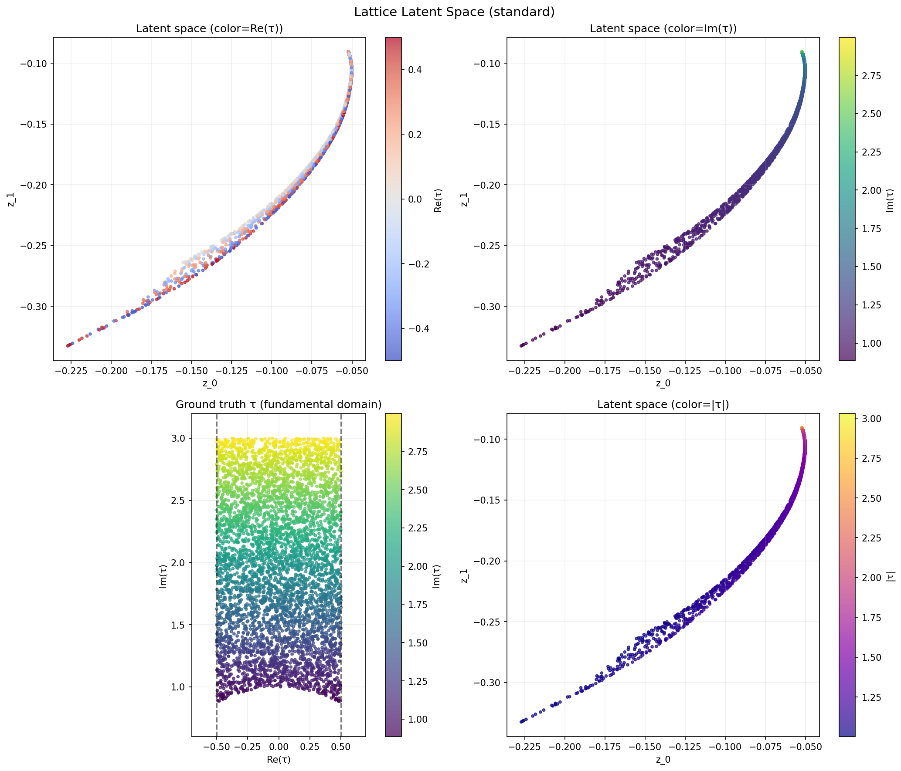
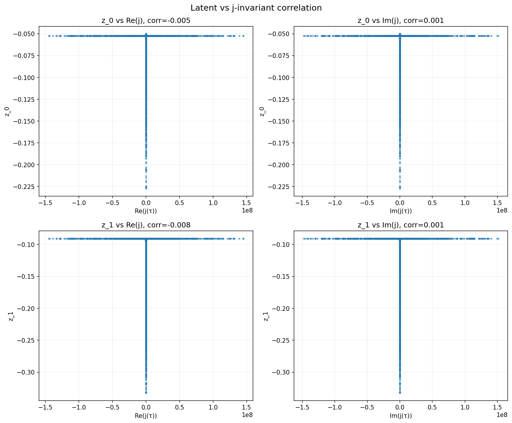
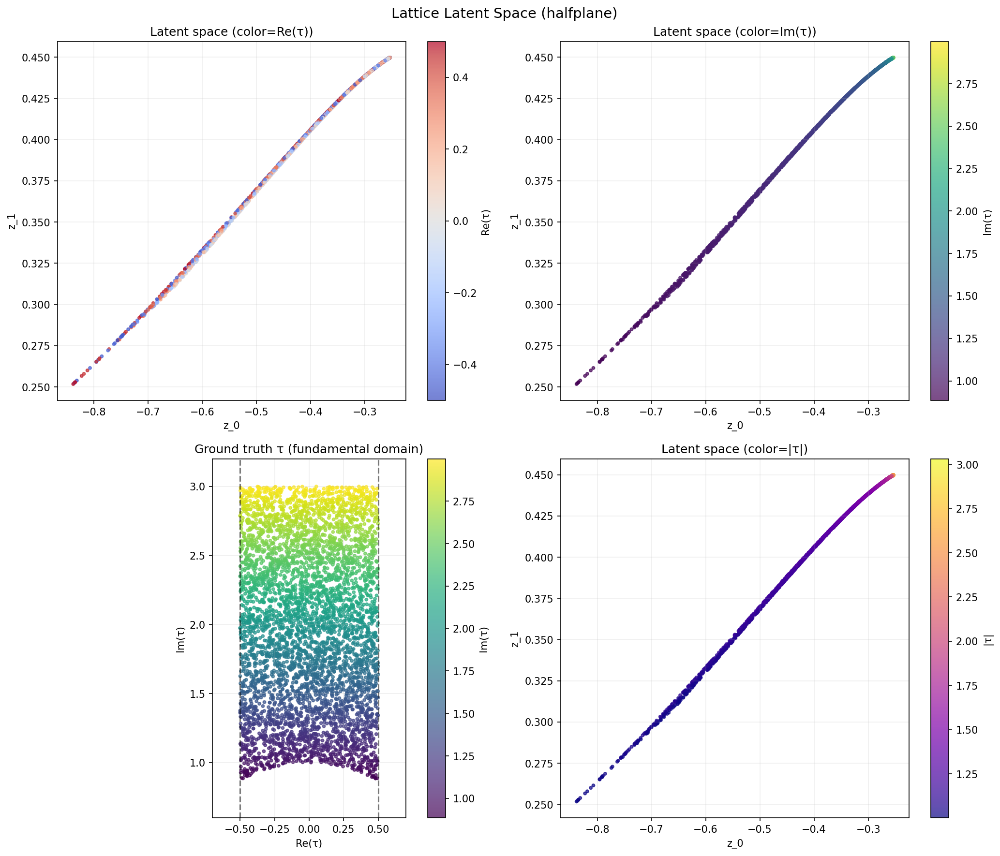
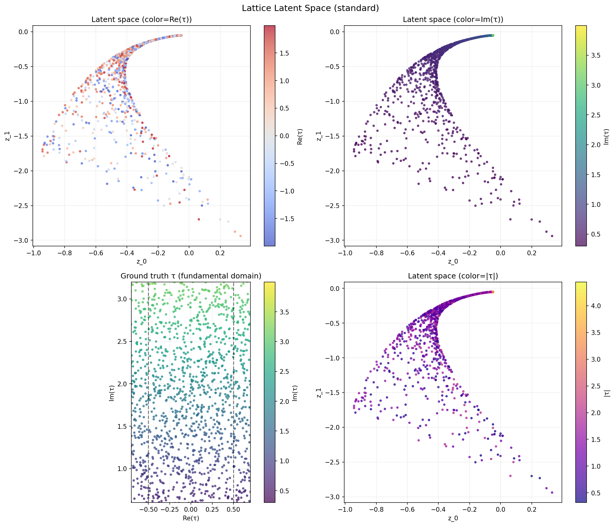
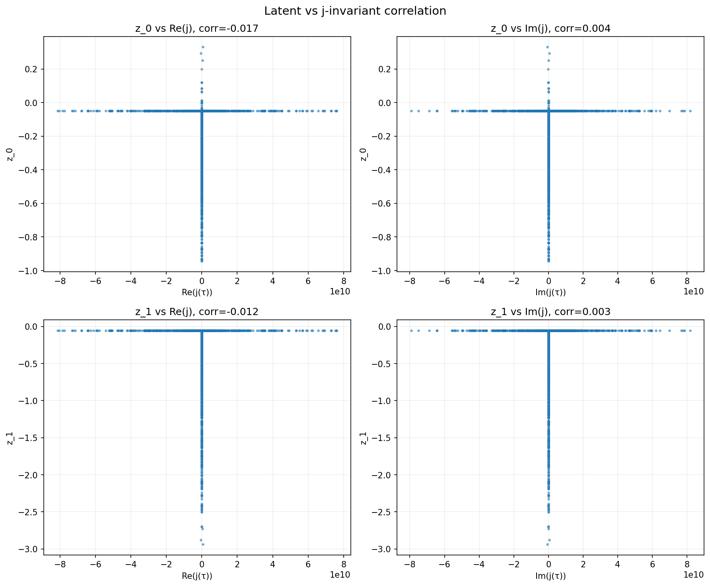

# Lattice Modular AE — Experiment Results & Analysis

## Summary

全3実験（L1, L2, L3）が正常に完了した。再構成誤差は極めて低い（MSE ≈ 0）が、**潜在空間は2次元の基本領域 $\mathcal{F}$ を再現できておらず、おおむね1次元曲線に退化している。** これはテータ関数の構造上予想可能な結果であり、次のステップへの重要な手がかりを提供する。

---

## Quantitative Results

| Experiment | MSE | MAE | j-corr | SL₂(Z) mean dist | SL₂(Z) max dist |
|---|---|---|---|---|---|
| **L1** Standard / $\mathcal{F}$ | 4.3e-8 | 1.2e-4 | 0.008 | 1.019 | 2.878 |
| **L2** HalfPlane / $\mathcal{F}$ | 2.0e-7 | 2.5e-4 | 0.008 | 2.053 | 5.805 |
| **L3** Standard / wide $\mathbb{H}$ | 5.3e-6 | 9.7e-4 | 0.017 | 0.958 | 2.865 |

> **Note:** 再構成誤差は全実験で極めて低い。AE は格子テータ関数を完璧に再構成する能力を持つが、問題は**潜在空間の構造**にある。

---

## Latent Space Analysis

### L1: Standard AE on Fundamental Domain

**潜在空間の散布図:**

Im(τ)で色づけすると滑らかな1次元曲線が見える。Re(τ)の情報は曲線に沿って混在している。



**j-不変量との相関:**

j(τ)の値域が10^8に達するため、線形相関がほぼゼロ。



**観察:**
- 潜在空間は**1次元曲線に退化**している（右上図: Im(τ)で色づけすると完全に単調な勾配）
- Re(τ) の情報は曲線上で微小な広がりとしてのみ残存
- 原因: $\mathrm{Im}(\tau)$ がθ関数の全体的なスケール（指数減衰率）を支配しており、エンコーダはこの「振幅情報」を最優先で捕捉する

### L2: HalfPlane AE on Fundamental Domain

HalfPlane制約付きの潜在空間。L1とほぼ同じ1次元曲線構造。



**観察:**
- L1 とほぼ同じ1D曲線構造。$y > 0$ 制約は曲線の位置を変えるだけ
- SL₂(Z) 不変性はむしろ悪化（mean dist: 2.05 vs L1の1.02）
- **結論:** 上半平面制約だけでは、潜在空間の構造改善に不十分

### L3: Standard AE on Wide Half-Plane

広域H からのサンプル。2Dに展開した構造が見え、SL₂(Z)同値な折り畳みの兆候がある。



**観察:**
- L1/L2 より**2次元的な広がり**が見られ、最も興味深い結果
- Im(τ)で色付けすると、高Im(τ)の点は1箇所（右上）に集中し、低Im(τ)の点は広がっている
- **SL₂(Z) 同値性:** mean dist = 0.958 は L1 より若干良好。テータ関数が同じ格子に対応する $\tau$ は、AE により近い潜在表現にマッピングされている兆候がある
- Re(τ) の情報がある程度回復している（左上図の色分布）

**j-不変量との相関 (L3):**



---

## Root Cause Analysis: なぜ 1D に退化するのか

### テータ関数のスケール問題

格子テータ関数 $\theta(t;\tau) = \sum \exp(-\pi|m+n\tau|^2 t)$ の主要項は最短ベクトル長 $\lambda_1(\tau)$ によって支配される:

$$\theta(t;\tau) \approx N_1 \cdot \exp(-\pi \lambda_1^2 \cdot t) + O(\exp(-\pi \lambda_2^2 \cdot t))$$

ここで $\lambda_1 = \min_{(m,n)\neq 0}|m+n\tau|$ は格子の最短ベクトル長。

- $\mathrm{Im}(\tau)$ が大きい → $\lambda_1 \approx 1$（$(1,0)$ ベクトル）→ 信号は $\approx 2e^{-\pi t}$
- $\mathrm{Im}(\tau)$ が小さい → $\lambda_1$ は $\mathrm{Re}(\tau)$ にも依存（特に $|\tau| \approx 1$ 近傍）

**結果:** テータ関数の信号は $\mathrm{Im}(\tau)$ に対して指数的に敏感だが、$\mathrm{Re}(\tau)$ に対しては（特に $\mathrm{Im}(\tau) > 1.5$ では）ほとんど変化しない。AE は最も分散の大きい方向（$\mathrm{Im}(\tau)$）を優先的にエンコードする。

### j-不変量のダイナミックレンジ問題

$j(\tau)$ は $\mathcal{F}$ のカスプ近傍（$\mathrm{Im}(\tau) \gg 1$）で $|j(\tau)| \sim e^{2\pi \cdot \mathrm{Im}(\tau)}$ と爆発的に増大する。$y_{\max} = 3.0$ では $|j| \sim 10^8$ に達し:
- 線形相関係数（Pearson）はカスプ近傍の数点に支配される
- 大多数の点は $j \approx 0$ 付近に密集し、相関が検出不能

---

## Key Findings

| # | Finding | Significance |
|---|---------|-------------|
| 1 | AE は完璧な再構成能力を持つ | 2次元潜在空間でテータ関数を完全にエンコード可能 |
| 2 | 潜在空間は Im(τ) 支配の 1D 曲線に退化 | テータ関数のスケール構造が支配的 |
| 3 | HalfPlane 制約は構造改善に不十分 | $y > 0$ は幾何的にあまりに弱い制約 |
| 4 | L3 (広域) が最も 2D 的構造を示す | $\mathrm{Re}(\tau)$ が広い範囲を持つと区別しやすい |
| 5 | j-不変量との線形相関は検出不能 | ダイナミックレンジ問題。非線形比較が必要 |

---

## Proposed Next Steps

> **Important:** 以下の改善方針のうち、どれを優先するか検討をお願いします。

### A. 信号正規化（最優先、即効性が高い）

テータ関数の「スケール」を除いて「形」だけを見せる：

```python
# 各信号を max で正規化
signals_normalized = signals / signals.max(axis=1, keepdims=True)
```

これにより $\mathrm{Im}(\tau)$ の情報が振幅ではなく**減衰曲線の形状**に移り、$\mathrm{Re}(\tau)$ の影響が相対的に増大する。

### B. j-不変量との比較改善

- **Spearman rank correlation:** スケール不変な相関
- **$\log|j|$ との比較:** ダイナミックレンジを抑制
- **Mutual Information:** 非線形依存関係の検出

### C. エンコーダアーキテクチャの強化

- **Latent dim = 4 or 8:** 2D では AE が1D 曲線に退化するプレッシャーが強い。高次元 latent + PCA で有効次元を分析
- **β-VAE:** KL 正則化でアイソトロピック（等方的）な潜在空間を促進
- **Contrastive loss:** 同じ格子（SL₂(Z)同値な $\tau$）のペアを近づける

### D. 基本領域制約の直接導入

- **Modular invariant loss:** $L_{\text{inv}} = \|z(\tau) - z(\gamma\tau)\|^2$ を明示的に追加
- **Projection layer:** 潜在空間→基本領域への微分可能な射影（ただし $T, S$ 操作の組み合わせは微分不可能なので近似が必要）
